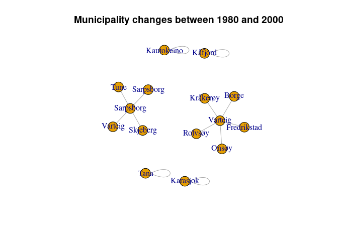

<!-- README.md is generated from README.Rmd. Please edit that file -->

# NoRwayGeo <a href="https://github.com/eirikberger/NoRwayGeo"></a>

The package uses a cleaned version of SSB’s overview of [historical
changes in the municipality
structure](https://www.ssb.no/metadata/alle-endringer-i-de-regionale-inndelingene/_/attachment/download/fe7adaa5-aeca-401f-95ff-688465ecf48f:0700aa845b3e92021383b96789be7237f87650ba/kommuneendringer_1838_2017.xlsx)
to produce clusters of municipalities that can be followed consistently
between two given years. It was developed to meet the needs of the
author and his coauthors.

## Installation

The development version from [GitHub](https://github.com/) with:

# Using it

# The current version of the package only supports Norwegian municipalities, which are built in.

``` r
# Load library
library(NoRwayGeo)
#> Loading required package: data.table
```

Run commands for years between and including 1980 and 2000.

``` r
print_changes(1980, 2000)
#>     from   to year tidligere_kommunenavn
#>  1:  102  105 1992             Sarpsborg
#>  2:  114  105 1992               Varteig
#>  3:  115  105 1992              Skjeberg
#>  4:  130  105 1992                  Tune
#>  5:  103  106 1994           Fredrikstad
#>  6:  113  106 1994                 Borge
#>  7:  131  106 1994               Rolvsøy
#>  8:  133  106 1994              Kråkerøy
#>  9:  134  106 1994                 Onsøy
#> 10: 1940 1940 1994               Kåfjord
#> 11: 2011 2011 1987            Kautokeino
#> 12: 2021 2021 1988              Karasjok
#> 13: 2025 2025 1992                  Tana
```

``` r
print_clusters(1980, 2000)
#>     muni_number cluster
#>  1:         102       1
#>  2:         114       1
#>  3:         115       1
#>  4:         130       1
#>  5:         103       2
#>  6:         113       2
#>  7:         131       2
#>  8:         133       2
#>  9:         134       2
#> 10:        1940       3
#> 11:        2011       4
#> 12:        2021       5
#> 13:        2025       6
#> 14:         105       1
#> 15:         106       2
```

``` r
graph_clusters(1980, 2000)
```



``` r
count_clusters(1980, 2000)
#> [1] 6
```

# Logo

The logo for this package uses a self portrait by famous Norwegian
painter [Nikolai Astrup](https://en.wikipedia.org/wiki/Nikolai_Astrup)
(1880–1928). His name brother, [Nikolai
Astrup](https://en.wikipedia.org/wiki/Nikolai_Astrup_(politician)), was
a minister in the Norwegian Government responsible for merging
municipalities as a part of a large reform in 2020-2021. He is therefore
responsible for increasing the problem of changing municipality
structures over time.
